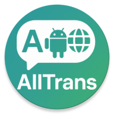
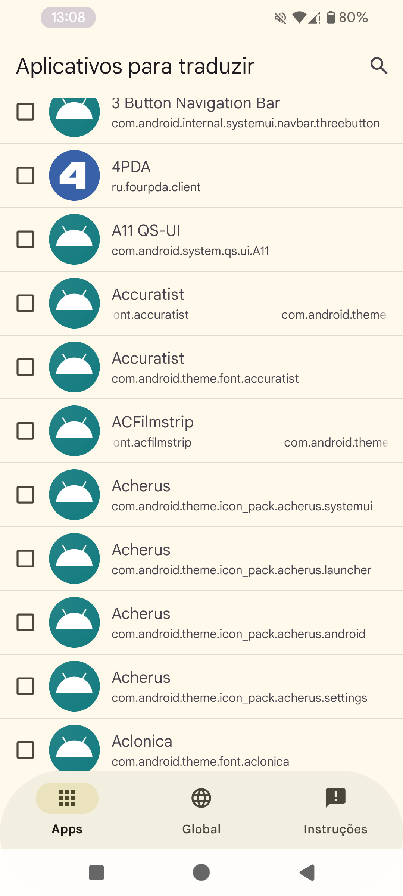
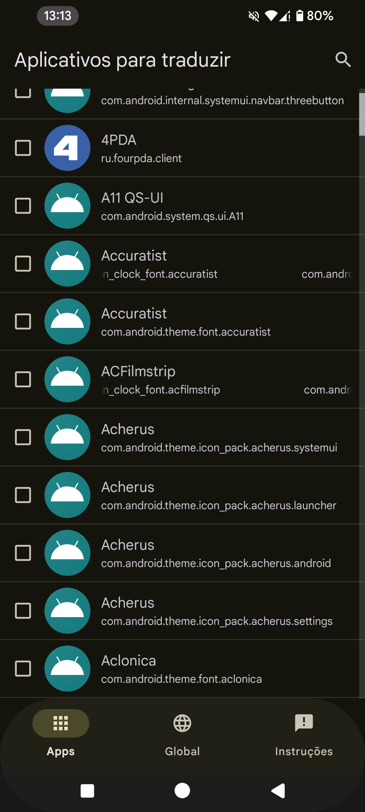
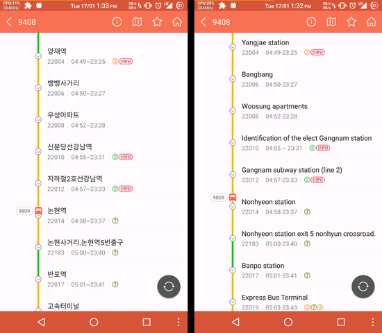
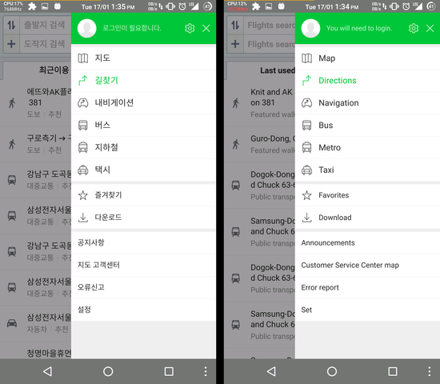
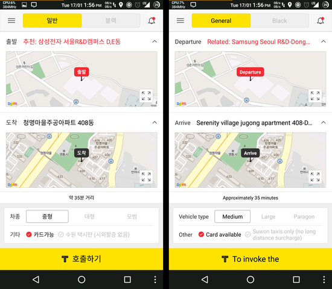

  

<h1 align="center">AllTrans</h1>

  Runtime translation for Android apps.
   
  Translate text inside selected apps without modifying the original APK.

  
  
  
  

## Overview

AllTrans translates text inside Android apps at runtime. It works like browser page translation, but for app interfaces: choose a source language, choose a target language, select the apps you want, and AllTrans replaces visible text while the app is running.

The project is designed for Xposed-compatible environments such as LSPosed. It can translate many normal Android apps without repacking, resigning, or modifying their APK files.

This enhanced edition focuses on making app translation faster, smarter, and more reliable on modern Android. It includes improvements to translation detection, runtime text replacement, compatibility handling, and LSPosed-based operation, while keeping the setup simple for daily use.

## Features

- Runtime app text translation through Xposed/LSPosed hooks.
- Improved translation detection engine for better text discovery inside apps.
- Smarter runtime replacement for dynamic screens and delayed app content.
- Per-app translation control.
- Global source and target language settings.
- Optional per-app overrides for difficult apps.
- Offline Google translation files support.
- Microsoft Translator support.
- WebView translation delay options.
- Aggressive mode for apps that need deeper text replacement.
- Compatibility options for apps that load slowly or crash when text is replaced too early.
- Compatible with Android 16 and older supported Android versions, focused on Android 10+.

## Screenshots

  
  

## Translation Example

  
  
  

## Requirements

- Android 10 or newer, including Android 16.
- LSPosed, Xposed, EdXposed, VirtualXposed, or another compatible Xposed environment.
- The target app must be enabled in the module scope when using LSPosed.
- Some games and heavily custom-rendered apps may not translate because they do not use normal Android text views.

## Basic Setup

1. Install AllTrans.
2. Enable AllTrans in LSPosed/Xposed.
3. Select the apps that AllTrans should hook.
4. Reboot or restart the target app.
5. Open AllTrans and choose the source and target languages.
6. Enable translation for the apps you want.

## Troubleshooting

If an app does not translate, confirm that the app is selected in the LSPosed scope and enabled inside AllTrans.

If an app freezes or crashes, open that app's AllTrans settings and increase the delay before replacing translated text. For WebView-heavy apps, also increase the WebView translation delay.

If only part of an app is translated, try Aggressive Mode for that app.

Games and apps that draw text directly with custom engines may not be compatible.

## Video

A Gadget Hacks video for an older AllTrans version is available here:

  

## License

AllTrans is licensed under the GNU General Public License v3.0 or later. See `LICENSE.GPL`.
